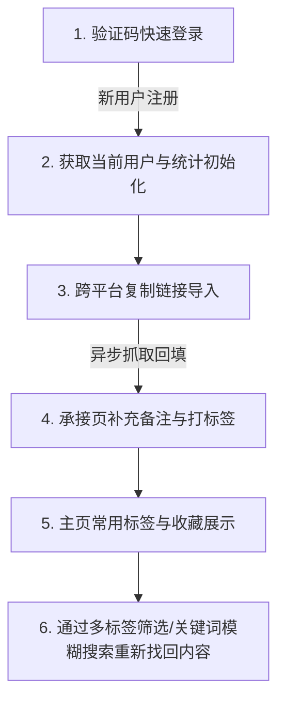

# LinkVault 项目答辩提纲（README 规范版）

本文件为 LinkVault 答辩演示的系统化提纲，采用标准项目 README 结构编写。旨在梳理核心逻辑、技术栈深度与项目亮点，为现场演示提供清晰的内容支撑。

---

## 1. 项目定位与背景

LinkVault 是一款面向个人用户的 **“带备注上下文的链接收纳工具”**。它专门解决用户在手机端浏览信息时，对“有价值的内容想先存下来，但后续极难回找”的痛点。

### 1.1 核心痛点
* **信息孤岛**：收藏分散在微信、B站、YouTube等各个平台，缺乏统一归集入口。
* **信息堆积**：常规收藏夹缺少二次加工，随时间退化为无序的“信息垃圾堆”。
* **上下文缺失**：回找内容时，用户往往只记得自己“当时为什么要保存它”，但原生平台不支持保存用户备注。

### 1.2 解决方案
用户通过复制链接导入 LinkVault，补充个性化备注，并通过多维标签进行分类。后续可通过标签筛选和标题/备注模糊搜索，以符合用户记忆逻辑的方式瞬间定位内容。

---

## 2. 系统技术栈 (Tech Stack)

项目前后端架构高度规范，采用了主流、健壮且易于扩展的技术架构。

### 2.1 后端技术栈 (Backend)
* **核心框架**：`Java 21` + `Spring Boot 3.5.x`（现代 Java 响应式与企业级开发基石）
* **构建与管理**：`Apache Maven`
* **持久层方案**：`MySQL 8.0`（数据库，采用 `utf8mb4` 字符集以完美兼容各平台复杂字符与 Emoji）+ `MyBatis Plus 3.5.x`（提供高效的通用 CRUD 与灵活的自定义 SQL 映射）
* **安全鉴权**：`JWT (JSON Web Tokens)` 无状态鉴权方案，结合自定义 `Spring Security Filter` 实现统一登录态拦截。
* **数据校验**：`Jakarta Validation` (Hibernate Validator 规范实现)，拦截前端脏数据。
* **网络与抓取**：`Java 11+ HttpClient`（高效异步 HTTP 通信） + 自研 HTML 解析器 + 第三方 `YouTube Data API v3`（获取视频元数据）。
* **异步多线程**：基于 Spring `ThreadPoolTaskExecutor` 线程池实现后台抓取，避免网络 I/O 阻塞主业务线程。
* **短信服务**：阿里云短信 `Aliyun SMS SDK`。

### 2.2 前端技术栈 (Frontend)
* **核心框架**：`uni-app`（基于 `Vue 3` 的跨平台开发框架，支持 H5 和 Android 编译适配）
* **构建工具**：`Vite`（新一代极速构建打包引擎）
* **状态管理**：`Pinia`（Vue 3 官方推荐的轻量化全局状态管理）
* **UI 组件库**：`uview-plus`（深度定制的高质量移动端 UI 组件库）
* **网络请求**：基于 `uni.request` 深度封装的 HTTP Client（提供全局响应拦截器、Token 自动追加与 401 自动重定向逻辑）

---

## 3. 项目核心亮点 (Core Highlights)

项目亮点清晰划分为**技术亮点**与**功能亮点**两个方面。

### 3.1 技术亮点 (Technical Highlights)
1. **API 契约驱动开发 (Contract-First)**：
   * 开发编码前，优先落实了标准的 [openapi.yaml](file:///e:/Workspace/linkvault/docs/engineering/openapi.yaml) 契约及 [接口文档.md](file:///e:/Workspace/linkvault/docs/engineering/接口文档.md)。
   * 前后端完全依据此标准开发与 Mock 联调，实现前后端接口的零偏差与高内聚。
2. **多层数据模型（DTO / VO / Entity）物理隔离**：
   * 数据模型隔离度极高。`DTO`（入参校验）、`VO`（向外吐出展示）和 `Entity`（表实体）各司其职。
   * 采用全局统一的 `ApiResponse<T>` 和 `GlobalExceptionHandler`，提供一致的 HTTP 状态码与精准的业务错误码（如 40001、40102、40901 等）。
3. **高并发异步非阻塞多源爬虫抓取**：
   * 用户提交导入 URL 时，主线程持久化链接后立即返回 `PENDING` 成功响应，保证用户操作秒级完成。
   * 后台通过 Spring 线程池异步抓取网页元素，结合 YouTube API，抓取完成后自动回填元数据，极大降低了由于网络超时导致的阻塞风险。
4. **短信服务双模式提供者设计**：
   * 采用接口化设计模式，编写了 `MockSmsProvider`（开发模式，默认验证码 `123456`，免除费用与等待）与 `AliyunSmsProvider`（生产模式），通过本地配置文件一键控制切换。
5. **前端 Stateless（无状态）组件设计规范**：
   * 严格要求 `src/components` 内的自定义组件必须为 Stateless，其内部不允许发起 API 网络请求和直接修改全局状态，数据依靠 `props` 传入，交互全部通过 `emits` 抛出，业务控制权彻底收拢于 `pages` 与 Pinia 层。
6. **网络层全局自动降级与状态闭环**：
   * 客户端拦截器自动校验返回状态，一旦发现 Token 过期或非法（返回 401 码），会自动清空本地缓存，并重定向到登录页，实现良好的运行期体验。

### 3.2 功能亮点 (Functional Highlights)
1. **一键式跨平台收纳**：
   * 支持多源链接（B站、YouTube、微信公众号、普通网页等）的统一提取、规范化与归集。
   * 支持短链展开，智能判断平台。
2. **深度上下文备注保留**：
   * 支持长达 1000 字的详细备注输入，帮助用户锁住导入瞬间的想法与主观记忆。
3. **多维度的标签分类系统**：
   * 支持多对多的收藏与标签关联关系。提供置顶标签、常用标签排序、以及“未打标签”的一键收纳视角。
4. **基于记忆线索的模糊检索**：
   * 统一搜索能力。支持“关键词 + 标签列表”叠加的 AND 筛选，支持“只查未打标签”和“按关键词匹配标题/备注”，让信息迅速回显。
5. **暗岩与琥珀（Dark Rock & Warm Amber）高级黑金视觉**：
   * 遵循 8px 空间间距规范，采用高级暗岩黑与琥珀金撞色设计，为用户提供极其舒适的沉浸式黑夜使用环境。

---

## 4. 演示现场操作闭环 (Demo Checklist)

答辩现场的功能演示将严格按照以下主线闭环进行：

1. **演示一：短信登录注册**：开启 Mock 模式，输入手机号和 `123456` 登入。若是新用户，自动在数据库建档并初始化默认昵称与头像。
2. **演示二：快速导入链接**：粘贴 Bilibili 链接或网页 URL。主页面秒级返回，并在后台开始异步元数据抓取。
3. **演示三：承接页整理**：输入个性化备注（例如“极具参考价值的 AI 视频”），并批量打上“AI动态”标签。
4. **演示四：精准检索与回找**：返回首页，查看已更新的收藏统计卡片，然后利用标签筛选和关键词“AI”搜索，瞬间将该条记录重新定位找回。
